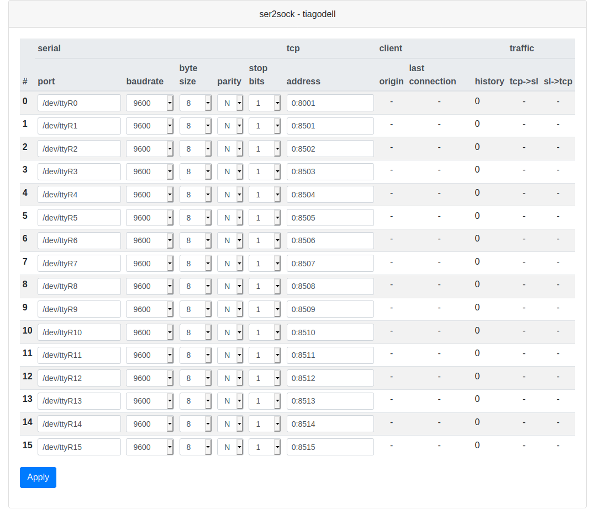

# ser2sock

![Pypi version][pypi]

A single-threaded, multi serial line to TCP bridge server.

Can run under python 2.6 up to 3.x (tested 3.8).

## Installation

From within your favorite python environment:

```console
pip install ser2sock
```

## Usage

```console
ser2net -c <configuration file>
```

### Configuration

In order to provide flexibility, configuration is written in python.

The only requirement is to have a `bridges` member which consists of a
sequence of bridges. A bridge is a dictionary with mandatory keys `serial`
and `tcp`.

Example:

```python

bridges = [
    {
        'serial': {'address': '/dev/ttyS0'},
        'tcp': {'address': ("0", 18500)}
    },
    {
        'serial': {'address': '/dev/ttyS1', 'baudrate': 19200},
        'tcp': {'address': ("0", 18501), 'no_delay': False}
    }
]
```

* `serial`: `address` mandatory. Supports any keyword supported by
  `serial.serial_for_url` (or `serial.Serial` if `serial_for_url` does not
  exist
* `tcp`: `address` mandatory (must be a pair bind host and port).
  * `reuse_addr`: (default: True) TCP reuse address
  * `no_delay`: (default: True) disable Nagle's algorithm
  * `tos`: (default: `0x10`, meaning low delay) type of service.

`tcp` and `serial` helpers are automatically loaded to the config namespace.
Here is the equivalent above config using helpers:

```python

bridges = [
    [serial(address="/dev/ttyS0"), tcp(address=("0", 18500))],
    [serial(address="/dev/ttyS1", baudrate=19200),
     tcp(address=("0", 18501), no_delay=False)],
]
```

You are free to put any code in your python configuration file.
Here is an example setting up logging:

```python
import logging
logging.basicConfig(
    level=logging.DEBUG,
    format='%(asctime)s %(levelname)s %(message)s'
)

bridges = [
    [serial(address="/dev/ttyS0"), tcp(address=("0", 18500))],
    [serial(address="/dev/ttyS1", baudrate=19200),
     tcp(address=("0", 18501), no_delay=False)],
]


```

## Web UI

The active configuration can be changed online through a web UI.

To enable web you need to install the extra package:

```console
$ pip install ser2sock[web]
```

...and enable the web app in the configuration with:

```python
bridges = [...]

web = ':8000'
```

ser2sock should now be visible [here](http://localhost:8000).

You should see something like this:



Note that changes made with the web interface only affect the
active ser2sock instance and never the original configuration file.

## Tests

Tests should be performed within a python 3.5 or higher environment.

```console
$ python setup.py test

running pytest
Searching for pytest-asyncio
Best match: pytest-asyncio 0.14.0
Processing pytest_asyncio-0.14.0-py3.7.egg

Using /home/tcoutinho/workspace/ser2sock/.eggs/pytest_asyncio-0.14.0-py3.7.egg
Searching for pytest-cov
Best match: pytest-cov 2.10.0
Processing pytest_cov-2.10.0-py3.7.egg

Using /home/tcoutinho/workspace/ser2sock/.eggs/pytest_cov-2.10.0-py3.7.egg
running egg_info
writing ser2sock.egg-info/PKG-INFO
writing dependency_links to ser2sock.egg-info/dependency_links.txt
writing entry points to ser2sock.egg-info/entry_points.txt
writing requirements to ser2sock.egg-info/requires.txt
writing top-level names to ser2sock.egg-info/top_level.txt
reading manifest file 'ser2sock.egg-info/SOURCES.txt'
writing manifest file 'ser2sock.egg-info/SOURCES.txt'
running build_ext
==================================== test session starts =====================================
platform linux -- Python 3.7.7, pytest-5.4.3, py-1.9.0, pluggy-0.13.1 -- /home/tcoutinho/miniconda/envs/py37/bin/python
cachedir: .pytest_cache
rootdir: /home/tcoutinho/workspace/ser2sock, inifile: setup.cfg
plugins: cov-2.10.0, asyncio-0.14.0
collected 8 items

tests/test_ser2sock.py::test_load_config PASSED                                        [ 12%]
tests/test_ser2sock.py::test_web_server PASSED                                         [ 25%]
tests/test_ser2sock.py::test_server PASSED                                             [ 37%]
tests/test_ser2sock.py::test_server_no_serial PASSED                                   [ 50%]
tests/test_ser2sock.py::test_server_serial_close_after_success PASSED                  [ 62%]
tests/test_ser2sock.py::test_server_no_client PASSED                                   [ 75%]
tests/test_ser2sock.py::test_server_missing_argument PASSED                            [ 87%]
tests/test_ser2sock.py::test_2_clients_to_1_serial PASSED                              [100%]

----------- coverage: platform linux, python 3.7.7-final-0 -----------
Name                   Stmts   Miss  Cover
------------------------------------------
ser2sock/__init__.py       1      0   100%
ser2sock/server.py       321     56    83%
------------------------------------------
TOTAL                    322     56    83%
Coverage HTML written to dir htmlcov


================================== slowest 2 test durations ==================================
0.02s call     tests/test_ser2sock.py::test_server_no_client
0.02s setup    tests/test_ser2sock.py::test_web_server
===================================== 8 passed in 0.30s ======================================
```

That's all folks!

[pypi]: https://img.shields.io/pypi/pyversions/ser2sock.svg
